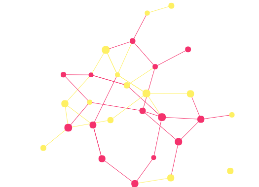

# Network Visualisation Packages

List of R packages for *network visualisation*.

## Interactive

- [igraph](http://igraph.org/r/)
- [networkD3](https://christophergandrud.github.io/networkD3/)
- [sigmajs](http://sigmajs.john-coene.com/)
- [visNetwork](https://datastorm-open.github.io/visNetwork/)
- [sigmaNet](https://iankloo.github.io/sigmaNet/)
- [DiagrammeR](http://visualizers.co/diagrammer/)
- [rthreejs](https://github.com/bwlewis/rthreejs)
- [aforce](https://aforce.john-coene.com/)
- [plotly](https://plot.ly/r/)
- [echarts4r](https://echarts4r.john-coene.com/)
- [particles](https://github.com/thomasp85/particles)

## Static

- [ggraph](https://github.com/thomasp85/ggraph)
- [ggnet2](https://briatte.github.io/ggnet/)
- [ggnetwork](https://briatte.github.io/ggnetwork/)
- [ndtv](https://github.com/statnet/ndtv)
